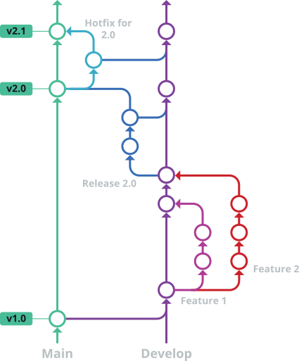

# Contributing

Thanks for taking an interest in this project. We want to make contributing to this project as easy and transparent as possible, whether it is:

* Reporting a bug
* Discussing the current state of the code
* Submitting a fix
* Proposing new features
* Becoming a maintainer

## We Develop with Github

We use Github to host code, to track issues and feature requests, as well as accept pull requests. Discussion and general support is typically done through Discord.

## We Use [Git Flow](https://www.gitkraken.com/learn/git/git-flow)

<div align="center" style="background:#0d1117"></div>

All code changes happen through pull requests. `develop` and `main` are
protected branches — direct commits and pushes are blocked. Integration uses
merged pull requests only (see ADR-0044).

### External contributors (fork-based)

1. Fork the repo. From the `develop` branch, create a feature branch:
   ```bash
   bash .github/scripts/new-branch.sh <type> <description>
   ```
   The helper resolves your username, generates the hash via `openssl rand -hex 2`,
   and creates the branch off `develop` (or `main` for hotfixes). See ADR-0028
   for the full naming convention.

   Allowed `<type>` values: `feat`, `fix`, `patch`, `docs`, `style`, `refactor`,
   `perf`, `test`, `build`, `ci`, `chore`, `revert`, plus `hotfix` and `release`.
2. If you have added code that should be tested, add tests.
3. If you have changed APIs, update the documentation.
4. Ensure it passes whatever tests are being used.
5. Make sure your code lints.
6. Open a pull request targeting `develop` (or `main` for hotfixes).

### Internal contributors (same-repository work-branch PRs)

1. Create a work branch off `develop` (or `main` for hotfixes/releases):
   ```bash
   bash .github/scripts/new-branch.sh <type> <description>
   ```
2. Commit your changes with signed conventional-commit messages.
3. Run `/check` and `@code-review` before opening a PR.
4. Open a pull request targeting `develop` (or `main` for hotfixes/releases).
   Use the `finishing-a-development-branch` skill to prepare the PR command.
5. A maintainer reviews and merges the PR. Never push directly to `develop`
   or `main`.

## Commit Message Policy

All commits must follow [Conventional Commits](https://www.conventionalcommits.org/)
format, enforced by [commitlint](https://commitlint.js.org/) via the
`.github/hooks/commit-msg` hook and in CI on every pull request.

**Required trailers** (every non-merge, non-revert commit):

- `Authored-by:` — the design/planning model (from `agent.plan.model` in `opencode.jsonc`)
- `Implemented-by:` — the coding model (from the PRIMARY tier / `agent.tdd.model` in `opencode.jsonc`)
- `Tested-by:` — the verification model (from `agent.code-review.model` in `opencode.jsonc`)

> **Note:** The Aurora submodule retains the old `Plan-by:`/`Acked-by:` footer
> names until a separate upstream PR lands. Aurora commits may need manual
> footer adjustment until then. See ADR-0031.
- `Signed-off-by:` — the human approver, resolved dynamically via
  `bash .github/scripts/resolve-identity.sh` (3-tier fallback per ADR-0029:
  `~/.config/opencode/prism.jsonc` → `prism.jsonc` → `git config`).
  Ships as `kyau <git@kyaulabs.com>` until a user runs `/setup`.

**Exemptions:**

- **Merge commits** (`git merge --no-ff`) and **revert commits** (`git revert`)
  are exempt from trailer enforcement — their messages are auto-generated and
  cannot carry trailers.
- **GitHub web-UI commits** (editing files on github.com) cannot add trailers or
  sign commits, and are therefore out-of-policy. Use a local clone with signed
  commits for all contributions.

**Local hook behavior:** if `commitlint` is not installed (fresh clone without
`npm install`), the `commit-msg` hook fails closed and blocks the commit. Run
`npm install` to restore the local toolchain; CI enforces the same policy on
every PR commit.

## Reporting Bugs / Feature Requests

We use Github issues to track public bugs and feature requests. Report a bug/feature by [opening a new issue](/../../issues); it is that easy!

## Contributions & Software Licensing

In short, when you submit code changes, your submissions are understood to be under the same [license](LICENSE) that covers the project itself. If you have a concern about this, please refrain from submitting a PR and contact a maintainer directly.
