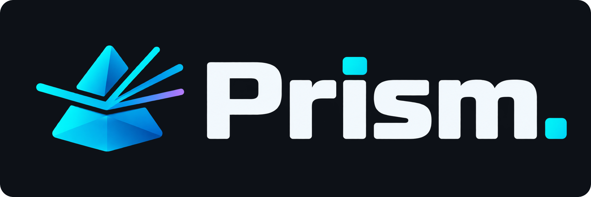

# 

[https://kyaulabs.com/](https://kyaulabs.com/)

[](CODE_OF_CONDUCT.md)
[](https://www.conventionalcommits.org/en/v1.0.0/)
[](LICENSE)
[](https://semver.org)\
[](https://github.com/zricethezav/gitleaks)
[](https://discord.gg/DSvUNYm)

Prism is a coding harness for [pi](https://pi.dev). It gives one coding agent a
disciplined path from an idea to a reviewed pull request through skills, prompt
templates, declared tools, and one safety extension.

Prism ships as two pi packages:

| Package | Install scope | Responsibility |
| --- | --- | --- |
| `@kyaulabs/prism-core` | Global | Language-independent workflow, safety, prompts, tools, and always-on agent instructions |
| `@kyaulabs/prism-php-web` | Project-local | PHP 8.5, Aurora, MariaDB, nginx, SCSS, vanilla JavaScript, Pest, and browser-tooling guidance |

The PHP/web adapter requires TDD, measures changed-file PHP coverage at 80%,
and keeps application code in explicit pages and helpers rather than an MVC
layer.

## Install

### Prerequisites

Install these before running Prism:

- Node.js 22.19 or newer;
- [pi](https://pi.dev);
- Git;
- Semgrep `>=1.173.0 <2.0.0`;
- OpenCodeReview (`ocr`) `>=1.9.1 <2.0.0`;
- PHP 8.5, Composer, MariaDB, nginx, and PCOV for PHP/web projects;
- Gitleaks and Shellcheck for the repository hooks.

Prism verifies Semgrep and OCR but never installs, configures, or authenticates
them. The package toolchain contracts own all bundled and consumer-development
tool versions.

### Install Core

From a source checkout:

```bash
bash packages/prism-core/scripts/install-global.sh
```

From npm after the first public package release:

```bash
pi install npm:@kyaulabs/prism-core
bash ~/.pi/agent/npm/@kyaulabs/prism-core/scripts/install-global.sh
```

The installer deploys the global
`AGENTS.md` and anti-drift prompt, then runs local-only readiness. It creates
neither OCR nor web-access consent and makes no provider or public-web request.

### Install the PHP/web adapter

Inside a PHP project:

```bash
pi install -l /path/to/prism/packages/prism-php-web
```

After publication, use:

```bash
pi install -l npm:@kyaulabs/prism-php-web
```

Pi asks you to trust a project before it loads project-local resources. This
repository loads both packages from its checkout through `.pi/settings.json`.

## Run setup

Open pi in the project and run `/setup`.

Established projects keep their existing files and enter the established setup
path. Setup inspects the active adapter, optional capabilities, package-release
state, and independent global OCR and web-access consent before proposing any
mutation.

Strict-empty `/setup` offers Template, Blank, or Cancel before adapter
selection. Template is the recommended source. You may choose Core-only or the
exact PHP/web adapter. Optional capabilities start disabled. Setup previews
public identity data and the complete project plan before asking for mutation
approval.

Pre-durable failure restores strict emptiness when Prism can prove ownership.
After durable application, setup retains one exact resume action through Git
repository creation, separate hook approval, quality-attested staging, and the
signed root seed. Setup creates no hosted repository or remote. The human
creates or configures the hosted repository, adds the remote, pushes `develop`,
and configures post-push rulesets.

`/setup` solely manages independent standing OCR and web-access consent. OCR
consent covers one connectivity test and reviewed-code egress through the
dedicated review operation. Web consent covers only bounded `web_search` and
`fetch_content`. Revoke either through `/setup` with
`prism-tool consent revoke-ocr` or `prism-tool consent revoke-web`.

## Daily development

The short path is:

```text
brainstorm or debug -> specify -> plan -> Red/Green/Refactor -> verify -> commit -> finalize -> human push
```

New behavior starts with `brainstorming`. Bugs start with `debug`. Approved
work is planned, implemented in vertical TDD slices, and verified before each
commit. `finishing-a-development-branch` cleans branch artifacts, synchronizes
the target, runs `/check`, records all four review axes, revalidates the branch,
and invokes preparation-only `/pr`.

See [Coding Harness](CODING_HARNESS.md) for the on-ramps, fast path, architecture
gates, TDD cycle, review chain, and finalization rules.

Ordinary commits use one standalone launcher call after exact staging:

```bash
prism-tool commit create --type feat --scope example --subject "add verified behavior"
```

The launcher owns attribution, signing, hooks, and post-commit verification. A
failed or non-exclusive attempt blocks further tools until `/reload`.

Humans push work branches and merge pull requests. Agents never push, merge,
or create pull requests.

## Commands

| Command | Purpose |
| --- | --- |
| `/setup` | Configure a project and manage independent standing OCR and web-access consent |
| `/doctor` | Run full readiness and the consented OCR connectivity test |
| `/prime` | Draft or refresh `CONTEXT.md` |
| `/router` | Route free-form work to the correct on-ramp or fast path |
| `/issue` | Create one issue or decompose an approved spec or plan |
| `/check` | Run the language-independent gate and the active adapter gate |
| `/security` | Run Semgrep and locked-dependency audits |
| `/research` | Produce cited research through bounded web-access tools |
| `/improve-architecture` | Report structural improvement opportunities |
| `/release` | Prepare a release branch, changelog, and human publication steps |
| `/pr` | Prepare a conventional title, complete body, and human-run `gh pr create` command |
| `/handoff` | Save bounded continuation context for another session |
| `/teach` | Explain completed work at the requested level |

Core prompt templates live in `packages/prism-core/prompts/`. The PHP/web
adapter adds `/check-php`, `/build-assets`, and `/deploy`.

## Skills

Skills load on demand. The full index is in
[`packages/prism-core/AGENTS.md`](packages/prism-core/AGENTS.md).

| Area | Main skills |
| --- | --- |
| Design and planning | `brainstorming`, `grilling`, `prototype`, `to-spec`, `architect`, `writing-plans`, `wayfinder` |
| Implementation | `executing-plans`, `tdd`, `verification-before-completion`, `debug` |
| Review and delivery | `code-review`, `spec-review`, `standards-review`, `receiving-code-review`, `finishing-a-development-branch` |
| Architecture and context | `domain-context`, `systems-design`, `adr`, `finding-duplicate-functions`, `explore`, `consult` |
| Security and dependencies | `security-coding`, `credential-protection`, `audit-deps` |
| PHP/web | `php-web-stack`, `tdd-php`, `database`, `security-coding-php`, `frontend-design`, `frontend-architecture`, `accessibility`, `scss-mobile-first`, `visual-review`, `pest-browser` |

`visual-review` checks user-authored cases in Chromium after frontend behavior
reaches Green. It captures mobile, desktop, 320px reflow, and changed-state
evidence. `pest-browser` remains limited to critical functional browser flows.

## Toolchain and readiness

Run local readiness before hooks, checks, pull-request preparation, or release
work:

```bash
prism-tool doctor --local-only
```

Full `/doctor` validates standing OCR consent, runs one OCR connectivity test,
and reports web-access readiness without a live request. CI provisions
compatible Semgrep and OCR versions only inside its ephemeral environment. It
creates no consent and performs neither OCR review nor web access.

Declared tools run through `prism-tool`. Core bundles commitlint, git-cliff,
and `markdownlint-cli2`; the PHP/web adapter resolves its development tools
from the consumer project according to its contract.

The Core Markdown gate checks changed ADRs and maintained documentation with a
packaged policy:

```bash
prism-tool markdown lint --cached
prism-tool markdown lint --changed-from REVISION
```

Pre-commit reads staged Markdown blobs. `/check` and CI read committed branch
blobs from the target merge base. Skills, prompts, agent instructions,
generated history, legal text, and unrelated templates are outside the initial
Markdown profile.

## Git, review, and release

`main` and `develop` are PR-only. Create work branches with the resolved
`new-branch.sh` helper. Branch names follow
`<type>/<username>-<hash>-<description>`; release branches use
`release/<semver>` and hotfixes use `hotfix/<username>-<hash>-<description>`.

Install repository hooks by resolving the scripts directory and running
`install-hooks.sh`. The hooks enforce staged linting, Markdown structure,
secret scanning, RCS headers, commit messages, branch names, protected-branch
policy, and fast-forward pushes.

Finalization records one complete initial review across tooling, structural,
requirement, and security axes. A fresh finalization acceptance is required
after repair. The next review covers only the continuous repair delta when the
review chain remains valid. Advisory findings do not block `/pr`; they remain
visible for disclosure. Blocking findings, missing axes, a dirty tree, a HEAD
mismatch, or base or history changes stop preparation.

`/release` authors the release branch and changelog. After the release PR merges,
CI creates the repository tag and GitHub Release, reconciles package tags, and
opens the back-merge PR. npm publication remains human-run; see
[NPM publishing](NPM.md).

## Issues and labels

Every issue has one GitHub issue type and one Progress field value. Optional
wayfinder and meta labels add navigation or workflow context. The canonical
vocabulary, colors, and field invariants are documented in
[`docs/agents/labels.md`](docs/agents/labels.md).

Public bugs and feature requests belong in
[GitHub Issues](https://github.com/kyaulabs/prism/issues). Send security reports
privately as described in [Security Policy](SECURITY.md).

## Project records

- `CONTEXT.md` defines domain terms, entities, invariants, boundaries, and
  non-goals.
- `adr/` contains Nygard-format architecture decisions. Accepted records are
  immutable; new decisions supersede old ones.
- `docs/specs/` and `docs/plans/` contain only active branch artifacts. Git
  history preserves completed work.
- `NOTICE` records third-party attribution.

## License and attribution

Prism is licensed under [AGPL-3.0-only](LICENSE). Package users may run Prism as
a tool. Redistribution or modified distribution must preserve the license,
source, copyright, and notice obligations.

The main upstream methods and tools are credited in [NOTICE](NOTICE), including
pi, Aurora, Pest, Superpowers, Distill's pstack provenance, Semgrep, Gitleaks,
commitlint, git-cliff, and OpenCodeReview (`ocr`).
