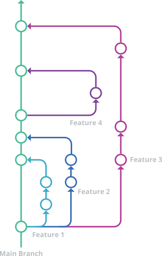

# 📘 template

[https://kyaulabs.com/](https://kyaulabs.com/)

[](CODE_OF_CONDUCT.md)
[](https://www.conventionalcommits.org/en/v1.0.0/)
[](LICENSE)
[](https://semver.org)
[](https://github.com/zricethezav/gitleaks)
[](https://discord.gg/DSvUNYm)

## About

This repository is the basis for all other repositories created here at KYAU Labs.

* GitHub limits repositories to 10GB of cache space for actions.
* GitHub limits users/organizations to 0.5GB of artifact storage.

Keep these factors in mind when setting up repositories.



* [About](#about)
* [Dependencies](#dependencies)
  * [Coverage driver](#coverage-driver)
  * [Gitleaks](#gitleaks)
  * [Harness tools](#harness-tools)
  * [Test setup](#test-setup)
* [New Repository](#new-repository)
  * [Clone](#clone)
  * [Initialize Repository](#init)
  * [Add Aurora Submodule](#add-aurora-submodule)
  * [Add License](#add-license)
  * [Add `.gitignore`](#add-gitignore)
  * [Update `README.md`](#update-readmemd)
  * [Configuration Files](#configuration-files)
  * [Add Actions](#add-actions)
* [Git Hooks](#git-hooks)
  * [Configuration](#configuration)
  * [Install Script](#install-script)
* [Initial Commit](#initial-commit)
  * [Stage All](#stage-all)
  * [Commit](#commit)
  * [Push](#push)
* [Repository Settings](#repository-settings)
  * [General](#general)
  * [Collaborators and Teams](#collaborators-and-teams)
  * [Branches](#branches)
  * [Webhooks](#webhooks)
* [Issue Labels](#issue-labels)
* [Coding Harness](#coding-harness)
  * [Quick-start loop](#quick-start-loop)
  * [Primary agents](#primary-agents)
  * [Built-in subagents](#built-in-subagents)
  * [Custom agents](#custom-agents)
  * [Slash commands](#slash-commands)
  * [Skills (on-demand)](#skills-on-demand)
  * [Project context — living docs](#project-context--living-docs)
  * [Activation](#activation)
  * [Model Configuration](#model-configuration)
* [Conventional Commits](#conventional-commits)
  * [Type](#type)
  * [Scope](#scope)
  * [Subject](#subject)
  * [Body](#body)
  * [Footer](#footer)
  * [Examples](#examples)
* [Changelog](#changelog)
  * [Manual changelog](#manual-changelog)
* [Attribution](#attribution)

## Dependencies

Install project dependencies via Composer and npm.

```text
composer install
npm install
```

### Test setup

No bootstrap step needed — `tests/Unit/Harness/ArchTest.php` ships
pre-configured with filesystem-walker arch tests (no debug functions,
strict types). The seven test subdirectories (`Unit`, `Feature`,
`Integration`, `Browser`, `Plugin`, `Semgrep`, `Shell`) are also
pre-created.

Run the test suite after `composer install`:

```text
php -d pcov.enabled=1 vendor/bin/pest --coverage
```

The coverage gate enforces ≥80% line coverage on changed PHP files via
`.github/scripts/coverage-gate.php`, wired into both CI and `/check`.
When you add new source directories, register them in `phpunit.xml`'s
`<source>` block so they enter the coverage denominator.

| Tool | Via | Purpose |
| --- | --- | --- |
| php-cs-fixer | Composer | PHP code style (PSR-12) |
| pestphp/pest | Composer | Testing framework (TDD) |
| pestphp/pest-plugin-arch | Composer | Architecture tests |
| pestphp/pest-plugin-browser | Composer | Browser tests (Playwright) |
| sass | npm | SCSS → CSS compilation |
| uglify-js | npm | JavaScript minification |
| eslint | npm | JavaScript linting |
| stylelint | npm | SCSS linting |
| commitlint | npm | Commit message validation |
| @commitlint/config-conventional | npm | Conventional commits preset for commitlint |
| git-cliff | npm | Changelog generation |
| playwright | npm | Browser testing |

### Coverage driver

Pest's `--coverage` flag requires PCOV, a code coverage driver for PHP.
The project uses **PCOV 1.0.12** (floor) across all platforms.

| Platform | Install |
| --- | --- |
| Linux | `sudo pecl install pcov-1.0.12` |
| macOS | `sudo pecl install pcov-1.0.12` |
| Windows | Download the matching DLL from [PECL](https://pecl.php.net/package/pcov/1.0.12/windows) and add `extension=php_pcov.dll` to `php.ini` |

> PECL is deprecated in favor of PIE
> ([github.com/php/pie](https://github.com/php/pie)). Once PCOV publishes a
> PIE-compatible package, switch to `pie install <package>`.

#### Default-disabled pattern (recommended)

PCOV adds overhead to every PHP process. Configure it default-disabled and
enable only when running tests with coverage:

1. Create a conf.d drop-in (path varies by platform):

    ```bash
    # Linux example (adapt to your PHP conf.d directory):
    echo "pcov.enabled=0" | sudo tee /etc/php/8.5/mods-available/pcov.ini > /dev/null
    ```

2. Enable per-run with the `-d` flag:

    ```text
    php -d pcov.enabled=1 vendor/bin/pest --coverage
    ```

The project's `/check` command, `@tdd` agent, and verification skills already
use the `-d pcov.enabled=1` flag. CI provisions PCOV enabled via
[shivammathur/setup-php](https://github.com/shivammathur/setup-php) and does
not need the flag.

### Gitleaks

Gitleaks scans commits for secrets at pre-commit time. Install globally via your package manager or from [gitleaks/releases](https://github.com/gitleaks/gitleaks/releases).

### Harness tools

In addition to the Composer and npm dependencies above, the coding harness uses the following external tools. Install them on the dev machine to enable the corresponding agents:

| Tool | Purpose | Install | Known-good version |
| --- | --- | --- | --- |
| [OpenCode](https://opencode.ai) | The coding harness platform | See [opencode.ai/docs](https://opencode.ai/docs/) | 1.17.13 |
| [Semgrep](https://semgrep.dev) | SAST scanning (`@semgrep` agent) | `pip install semgrep` or [releases](https://github.com/semgrep/semgrep/releases) | 1.168.0 |
| [OpenCodeReview (`ocr`)](https://alibaba.github.io/open-code-review/) | Code review (`@code-review` agent) | [docs](https://alibaba.github.io/open-code-review/) | 1.7.1 |
| [gitleaks](https://github.com/gitleaks/gitleaks) | Secrets scanning at pre-commit | [releases](https://github.com/gitleaks/gitleaks/releases) | 8.30.1 |

> Recommended floor versions, not hard pins — refresh on each release.

## New Repository

Base the repository off of the organization template repository.

### Clone

Clone the template and remove its git history. The `aurora/` directory is
shipped as an uninitialized submodule placeholder; remove it too so it can be
re-registered cleanly in the new repository.

```text
git clone https://github.com/kyaulabs/template <REPOSITORY_NAME>
cd <REPOSITORY_NAME>
rm -rf .git aurora
```

### Init

Initialize your new repository.

```text
git init
```

### Add Aurora Submodule

The Aurora PHP Framework is a required submodule. The template ships a
pre-registered `.gitmodules` entry for `aurora` (including its `branch = main`
tracking directive), so a plain `git submodule add` reconciles the existing
entry rather than creating a new one:

```text
git submodule add https://github.com/kyaulabs/aurora aurora
```

> **Note:** If you cloned the template to contribute to it directly (rather
> than basing a new repository on it), do not re-init. Instead run
> `git submodule update --init` after cloning to check out the pre-registered
> submodule at its committed revision.

### Add `LICENSE`

Add in a `LICENSE` of choice, using the filename `LICENSE.txt`, `LICENSE.md` or `LICENSE.rst`. There are two main repositories of licenses to choose from:

* GNU: [GNU APGLv3](https://choosealicense.com/licenses/agpl-3.0/) / [GNU GPLv3](https://choosealicense.com/licenses/gpl-3.0/) / [GNU LGPLv3](https://choosealicense.com/licenses/lgpl-3.0/)
* General: [Apache License 2.0](https://choosealicense.com/licenses/apache-2.0/) / [MIT License](https://choosealicense.com/licenses/mit/) / [Mozilla Public License 2.0](https://choosealicense.com/licenses/mpl-2.0/)
* CC: [CC BY 4.0](https://creativecommons.org/licenses/by/4.0/) / [CC BY-SA 4.0](https://creativecommons.org/licenses/by-sa/4.0) / [CC BY-ND 4.0](https://creativecommons.org/licenses/by-nd/4.0) / [CC BY-NC 4.0](https://creativecommons.org/licenses/by-nc/4.0) / [CC BY-NC-SA 4.0](https://creativecommons.org/licenses/by-nc-sa/4.0) / [CC BY-NC-ND 4.0](https://creativecommons.org/licenses/by-nc-nd/4.0)

### Add `.gitignore`

Add a  `.gitignore` template from [@github/gitignore](https://github.com/github/gitignore) (modification required).

### Update `README.md`

Take this time to update the `README.md` with at least basic repository information and a hopeful table of contents. It is okay if most sections are blank.

### Configuration Files

Several files reference `kyaulabs/template` and must be updated to reflect your new repository:

| File | What to update |
| --- | --- |
| `cliff.toml` | All `github.com/kyaulabs/template` URLs → new repo location |
| `composer.json` | `name`, `description`, and `license` fields |
| `package.json` | `name` and `description` fields |
| `opencode.json` | `build` agent prompt references the project; update repo-specific pointers |
| `CONTEXT.md` | Fill in the domain glossary, entities, invariants, and non-goals (or run `/prime` to draft) |
| `commitlint.config.js` | Remove any unused types from `type-enum` if needed |
| `phpunit.xml` | Add `<app>/` and new source directories to the `<source>` block so they enter the coverage denominator |

### Add Actions

The template ships with a base CI workflow (`.github/workflows/ci.yml`) —
lint, test, SAST, and commitlint. Add supplementary workflows from
[@kyaulabs/template-workflows](https://github.com/kyaulabs/template-workflows)
as your project requires.

Edit each workflow after adding it — workflows from template-workflows ship
with manual activation set and automatic activation commented out.

```yaml
on:
  workflow_dispatch: {}
#on:
#  push:
#    branches: [ "main", "develop" ]
#  workflow_dispatch:
```

## Git Hooks

### Configuration

The repository ships with a `commitlint.config.js` using the project's
custom type-enum (see [Conventional Commits](#conventional-commits) below).
No generation step is required — edit the file directly only if you need to
add or remove commit types.

### Install Script

Run the install script once after cloning to activate the git hooks:

```text
bash .github/scripts/install-hooks.sh
```

The script sets `git config core.hooksPath .github/hooks` — git's native
hooks mechanism. No symlinks are created, no files are backed up, and no
executable bits are changed. Git runs every hook in `.github/hooks/`
directly from the working tree.

> [!IMPORTANT]
>
> Setting `core.hooksPath` **silently supersedes** any hooks already in
> `.git/hooks/` — they stop firing for this repository. If you keep
> personal hooks there, migrate them into `.github/hooks/` or unset the
> config (`git config --unset core.hooksPath`) to restore them.

Six hooks are activated:

| Hook | Behavior |
| --- | --- |
| `pre-commit` | PHP syntax check, php-cs-fixer, Stylelint, ESLint, Shellcheck, gitleaks, and an idempotent RCS header normalizer that auto-adds/repairs headers on staged source files. |
| `commit-msg` | commitlint against the project type-enum. Skips with a notice when `commitlint` is not installed (e.g. before `npm install`). |
| `prepare-commit-msg` | Blocks `--amend` of a commit already pushed to a remote. Also blocks `-c HEAD` / `-C HEAD` (indistinguishable from `--amend` in this hook) — use an explicit SHA as a workaround. |
| `pre-push` | **Hard gate:** blocks non-fast-forward pushes (rewrites of published history from `amend`/`rebase`/`reset`). **Soft gate:** warns on single-commit pushes that look like squashes (no-squash policy). |
| `post-checkout` | `git submodule update --init --recursive`. |
| `post-merge` | `git submodule update --init --recursive`. |

## Initial Commit

### Stage All

Add all files to the repository. The first command utilizing the dry-run switch to make sure you do not need any last minute additions to `.gitignore`.

```text
git add -A -n
git add -A
```

### Commit

Push the initial commit with (non-commitlint verified message).

```text
git commit -S -a -m "ignore: here be dragons"
```

The `ignore` type is project-specific (defined in `commitlint.config.js`) and excluded from the changelog. It exists for the initial repository commit and is otherwise unused — do not adopt it for normal commits.

Finally set the main branch name.

```text
git branch -M main
```

### Push

Add the remote origin and push the branch to origin.

```text
git remote add origin git@github.com:kyaulabs/<REPOSITORY_NAME>.git
git push -u origin main
```

## Repository Settings

In order to have proper repository security, some settings need to change. Open up the repository settings by clicking on the `Settings` tab at the top of the repository.

### General

Upload an image to customize the repository's social media preview.

* Image should be 1280×640px

Under the `Features` section enable `Sponsorships` and then disable anything that is not being using.

### Collaborators and Teams

Under manage access click on `Add people`. In the search box enter and select `@kyaulabs-bot` then change the role to `Write`.

 @kyaulabs-bot

### Branches

Create a new branch protection rule by clicking `Add branch protection rule`.

* Branch name pattern: `main`
* Protect matching branches:
  * `Require a pull request before merging`
  * `Require approvals (1)`
  * `Require status checks to pass before merging` — add `Lint, Test & Security` (the CI workflow job's display name)
  * `Require signed commits`

Click `Create`.

Create another branch protection rule with the following:

* Branch name pattern: `**/**`
* Protect matching branches:
  * `Require signed commits`

### Webhooks

If you would like this repository to output to a channel on Discord you will need to create a webhook on both ends.

In Discord goto the `Server Settings > Apps > Integrations` and click `New Webhook`. Give it an avatar, name and select a channel for it to output to.

Back on GitHub on the `Settings > Webhooks` page, create a new hook by clicking `Add webhook`.

* Payload URL: Click on `Copy Webhook URL` in Discord to get this URL.
* Content type: `application/json`
* Let me select individual events:
  * `Commit comments` `Forks` `Issues` `Page builds` `Pull requests` `Pushes` `Releases` `Statuses` `Wiki`

Click on `Add webhook`.

## Issue Labels

Organization level issue labels work in conjunction with conventional commits. We use a modified version of the [TIPS](https://www.fat.codes/articles/tips-issue-labeling-system/) system called TPS or Type, Priority and Status as a way to label issues such that they can be organized and assigned accordingly.

In order to properly label something be sure to include at least one type, a single priority and it's current status. Optional labels may be added at your discretion.

**T - Type:** Directly corresponds to the conventional commits [type](#type).

| Group | Label | Color | Description |
| :---: | :---: | :---: | --- |
| Type | `feature` | <span style="color:#41d6c3">#41d6c3</span> | 🚀 Feature |
| Type | `patch` | <span style="color:#41d6c3">#41d6c3</span> | 🩹 Patches |
| Type | `bug` | <span style="color:#ff5050">#ff5050</span> | 🐛 Bug |
| Type | `documentation` | <span style="color:#c0e6ff">#c0e6ff</span> | 📝 Documentation |
| Type | `performance` | <span style="color:#41d6c3">#41d6c3</span> | ⚡️ Performance |
| Type | `refactor` | <span style="color:#ffa572">#ffa572</span> | ♻️ Refactor |
| Type | `style` | <span style="color:#ffa572">#ffa572</span> | 💄 Styling |
| Type | `test` | <span style="color:#ffd791">#ffd791</span> | ⚗️ Testing |
| Type | `ci/cd` | <span style="color:#ffd791">#ffd791</span> | 👷 CI/CD |
| Type | `chore` | <span style="color:#ffd791">#ffd791</span> | 🔮 Misc |
| Type | `security` | <span style="color:#ff5050">#ff5050</span> | 🔒️ Security |

**P - Priority:** The urgency of the issue/task.

| Group | Label | Color | Description |
| :---: | :---: | :---: | --- |
| Priority | `critical` | <span style="color:#800000">#800000</span> | Security-related/Project-breaking |
| Priority | `high` | <span style="color:#c11c00">#c11c00</span> | Foundational / Important |
| Priority | `medium` | <span style="color:#f39a4d">#f39a4d</span> | Basic / Normal |
| Priority | `low` | <span style="color:#8cd211">#8cd211</span> | Additional / Polish |

**S - Status:** Current progress.

| Group | Label | Color | Description |
| :---: | :---: | :---: | --- |
| Status | `done` | <span style="color:#0e8a16">#0e8a16</span> | Complete |
| Status | `in progress` | <span style="color:#fbca04">#fbca04</span> | Currently Working On |
| Status | `testing` | <span style="color:#fbca04">#fbca04</span> | Testing Ideas / Methods |
| Status | `under construction` | <span style="color:#fbca04">#fbca04</span> | Beginning Stages |

**Optional:** Two other groups are included for convinience.

| Group | Label | Color | Description |
| :---: | :---: | :---: | --- |
| Feedback | `brainstorming` | <span style="color:#db2780">#db2780</span> | Coming Up w/ New &lt;Type&gt; |
| Feedback | `help wanted` | <span style="color:#db2780">#db2780</span> | Help Requested on &lt;Type&gt; |
| Feedback | `research` | <span style="color:#db2780">#db2780</span> | &lt;Type&gt; Needs Research |
| Feedback | `request for comments` | <span style="color:#db2780">#db2780</span> | External Opinions Needed on &lt;Type&gt; |
| Other | `good first issue` | <span style="color:#4e3cb2">#4e3cb2</span> | Good Issue for First Time Contributor |
| Other | `duplicate` | <span style="color:#cfd3d7">#cfd3d7</span> | Duplicate &lt;Type&gt; |
| Other | `invalid` | <span style="color:#cfd3d7">#cfd3d7</span> | Invalid &lt;Type&gt; |
| Other | `on hold` | <span style="color:#cfd3d7">#cfd3d7</span> | Currently On Hold |
| Other | `won't fix` | <span style="color:#cfd3d7">#cfd3d7</span> | This Will Not Be Fixed |

## Coding Harness

This template ships with an [OpenCode](https://opencode.ai) coding harness — a collection of agents, skills, and commands that enforce project conventions during AI-assisted development. The harness lives under `.opencode/` and is wired into OpenCode via `opencode.json`.

**Reference docs:**

* **`AGENTS.md`** — AI-facing instructions: stack, boundaries, conventions, and available tools (loaded by every session)
* **`CODING_HARNESS.md`** — Orientation guide: built-in features, pipeline overview, and pointers (agents load `AGENTS.md` as the authoritative source)
* **`CONTEXT.md`** — Domain glossary, entities, invariants, boundaries, non-goals (living doc — agents read and update it)
* **`adr/`** — Architecture Decision Records in Nygard format (living docs — supersede, don't edit)
* **`opencode.json`** — Wires instructions + agent definitions + permissions into the coding agent
* **`docs/POSITIONING.md`** — Why this stack and harness exist (design rationale, differentiators)
* **`NOTICE`** — Third-party attribution and provenance

### Quick-start loop

The full engineering pipeline, end to end:

```text
brainstorming → prototype (if needed) → writing-plans → executing-plans → @tdd (per task) → verification-before-completion → /check → @code-review
```

1. **Brainstorm** — load the `brainstorming` skill; refine the idea through one-question-at-a-time grilling, propose 2–3 approaches, present the design in sections, get user approval. Saves a spec to `docs/specs/`.
2. **Prototype** (if needed) — load the `prototype` skill; build throwaway code to answer technical viability questions before committing to a plan. Delete after capturing the answer.
3. **Plan** — load the `writing-plans` skill; break the approved spec into bite-sized TDD tasks with exact file paths, interfaces, complete code, and verification commands. Saves a plan to `docs/plans/`.
4. **Execute** — load the `executing-plans` skill; dispatch tasks to `@tdd` with review gates between tasks. Halt and re-plan if a task reveals a design flaw.
5. **Implement** — invoke `@tdd` per task (Red → Green → Refactor, vertical slices). The harness enforces 80% line coverage.
6. **Verify** — load the `verification-before-completion` skill; re-run tests, confirm green, confirm no debug artifacts remain, confirm lint passes.
7. **Gate** — run `/check` (php-cs-fixer + stylelint + eslint + pest --coverage). On green, commit with a conventional message.
8. **Review** — invoke `@code-review` before push.

For non-trivial or cross-cutting changes, run `@architect` after the spec and before ticketing/planning — it returns a go/no-go plus a parseable `ADR-required:` line. The ticketing skill (`/issue`) checks this line before slicing a spec into tasks. For bugs, use `@debug` (disciplined 6-phase loop) before `@tdd` on the fix. For architectural entropy, run `/improve-architecture` on a cadence.

### Primary agents

| Agent | Purpose |
| --- | --- |
| **Build** | Default mode — full tool access; enforces mandatory `@tdd` and the project's hard boundaries |
| **Plan** | Restricted mode — analysis and planning only; cannot edit files or invoke code-modifying subagents |

Press `Tab` to switch between Build and Plan during a session.

### Built-in subagents

| Agent | Purpose |
| --- | --- |
| `@explore` | Read-only codebase exploration — file patterns, keyword search |
| `@scout` | External docs + dependency research (clones upstream repos) |
| `@general` | Multi-step research, full tool access |

### Custom agents

| Agent | When to use |
| --- | --- |
| `@tdd` | Any new feature or bug fix requiring tests (mandatory for new code) |
| `@test-audit` | Auditing an existing test suite for quality |
| `@code-review` | Reviewing staged changes before push (uses `ocr`) |
| `@architect` | Read-only evaluation of a proposed change against `CONTEXT.md` + ADRs before implementation |
| `@resolve-merge-conflicts` | Resolving in-progress git merge/rebase conflicts |
| `@semgrep` | SAST scanning — diff audit + full scan (PHP/JS/secrets) |
| `@debug` | Investigating bugs — disciplined 6-phase loop: feedback loop → reproduce → hypothesise → instrument → fix → post-mortem. Build-mode agent with scoped investigation write (repro tests, harnesses, instrumentation); not invocable from Plan mode. |
| `@docs-writer` | Generating PHPDoc, RCS headers, and documentation |
| `@consult` | Conversational project exploration — runs grilling, writes glossary terms + ADRs, never enters the engineering pipeline |
| `@from-issue` | Issue on-ramp — classifies type, grills one-at-a-time, applies Type + Progress, analyzes, plans, and dispatches @tdd |

### Model Configuration

Models are assigned via environment variable substitution (`{env:VAR}`) in
`opencode.json` and `.opencode/agents/*.md` — no hard-coded model IDs.
Four tiers, each mapped to a different `OPENCODE_MODEL_*` env var:

| Tier | Env Var | Default | Agents |
| --- | --- | --- | --- |
| Primary | `OPENCODE_MODEL_PRIMARY` | `deepseek/deepseek-v4-pro` | build, tdd, architect, code-review, debug, resolve-merge-conflicts, test-audit, general, explore |
| Planner | `OPENCODE_MODEL_PLANNER` | `openrouter/z-ai/glm-5.2` | plan, from-issue |
| Judge | `OPENCODE_MODEL_JUDGE` | `openrouter/z-ai/glm-5.2` | judge |
| Utility | `OPENCODE_MODEL_UTILITY` | `deepseek/deepseek-v4-flash` | compaction, title, summary, docs-writer, semgrep |

**Default delivery:** A direnv `.envrc` automatically sources the committed
`.opencode/models.default.env` when you `cd` into the project.

1. **Install the direnv shell hook** (one-time, per-shell):

   ```fish
   # fish
   echo 'direnv hook fish | source' > ~/.config/fish/conf.d/direnv.fish
   ```
   ```bash
   # bash
   echo 'eval "$(direnv hook bash)"' >> ~/.bashrc
   ```
   ```zsh
   # zsh
   echo 'eval "$(direnv hook zsh)"' >> ~/.zshrc
   ```

   Restart your shell, or `exec $SHELL -l`.

2. **Trust the .envrc** (one-time, per-clone):

   ```bash
   cd /path/to/repo
   direnv allow
   echo $OPENCODE_MODEL_PRIMARY      # verify: deepseek/deepseek-v4-pro
   ```

Without direnv, add to your shell profile:
```bash
source /path/to/repo/.opencode/models.default.env
```

**Customizing via /setup:** Run `/setup` to interactively choose models for
each tier. Choices are written to `~/.config/opencode/models.env` (sourced
by `.envrc` after the defaults, so user choices take precedence).

**Config file precedence** (per OpenCode `config.mdx`; later sources override
earlier ones):

1. Remote config (`.well-known/opencode`)
2. Global config (`~/.config/opencode/opencode.json`)
3. `OPENCODE_CONFIG` custom path
4. **Project config (`opencode.json`)** ← `{env:VAR}` references live here
5. `.opencode/` directories (agents, commands, etc.)
6. `OPENCODE_CONFIG_CONTENT` (inline, runtime)
7. Managed settings (admin-controlled, MDM, mobileconfig)

**Override mechanisms** (in order of escalation):

- **Change models in /setup** — writes user choices to `~/.config/opencode/models.env`
- **Edit `.opencode/models.default.env`** — change defaults committed to the repo
- **CLI flag** — `opencode --model anthropic/claude-sonnet-4-5` (overrides
  top-level; per-agent `{env:VAR}` references still resolve from env vars)
- **Inline config** — `OPENCODE_CONFIG_CONTENT='{"agent":{"build":{"model":"..."}}}' opencode`

**Choosing a model and variant:** The defaults are tuned for the three
models shipped in `.opencode/models.default.env`. To use a different
model — or to confirm which `variant` values it accepts, what its context
window is, and how to map a task onto a `variant` + `temperature` pair —
see [`.opencode/docs/model-configuration.md`](.opencode/docs/model-configuration.md).

### Slash commands

| Command | Purpose |
| --- | --- |
| `/prime` | Draft or regenerate `CONTEXT.md` from the codebase |
| `/check` | Pre-push gate: php-cs-fixer + stylelint + eslint + pest --coverage (80%) |
| `/release` | git-cliff changelog + signed tag + `gh release` command |
| `/deploy` | Post-pull production deploy — asset rebuild, opcache clear, log tail |
| `/research` | Cited research via `@scout` + web (see `.opencode/docs/research.md`) |
| `/build-assets` | Rebuild minified CSS and JS from SCSS/JS sources |
| `/security` | SAST scan + dependency CVE audit in one pass |
| `/improve-architecture` | Scan codebase for deepening opportunities → Obsidian markdown report |
| `/handoff` | Compact current conversation into a handoff document for another session |
| `/setup` | Interactive project configurator — replaces `<app>`/`<domain>`/`[EMAIL]` placeholders, sets accent theme |
| `/setup-labels` | Idempotently create/update standardized issue labels on the GitHub repo via `gh label` |
| `/doctor` | Toolchain health check — verifies dev tools at version floors; reports PASS/FAIL/SKIPPED + go/no-go |
| `/teach` | Explain recently completed work — what changed, why, what trade-offs were considered |
| `/issue` | Create a single issue, or decompose a plan/spec into an epic with vertical-slice tasks |
| `/ticket` | Alias of `/issue` (singular mode) |
| `/issues` | Decompose a plan or spec into a GitHub epic with vertical-slice task issues and native blocking edges |
| `/tickets` | Alias of `/issues` (from-spec decomposition) |


OpenCode also provides built-in slash commands (`/init`, `/undo`, `/redo`,
`/share`, `/help`) — see `CODING_HARNESS.md` for the full list.

### Skills (on-demand)

Skills load when an agent needs them — they are not loaded into every session. Load one explicitly with the `skill` tool, or let the agent pull it when the task matches.

| Category | Skills |
| --- | --- |
| Engineering pipeline | `brainstorming`, `grilling`, `prototype`, `to-spec`, `writing-plans`, `executing-plans`, `ticketing`, `verification-before-completion` |
| Review triage | `receiving-code-review` |
| Branch lifecycle | `finishing-a-development-branch` |
| Architecture hygiene | `systems-design`, `finding-duplicate-functions` |
| Stack-specific | `aurora-page`, `rcs-header`, `security-coding`, `database` |
| Frontend | `frontend-design`, `scss-mobile-first`, `frontend-architecture`, `accessibility` |
| Testing | `pest-browser` |
| Docs & process | `domain-context`, `adr`, `conventional-commits`, `audit-deps`, `writing-skills`, `opencode-docs` |

### Project context — living docs

* **`CONTEXT.md`** — the domain's *what* and *why*: glossary, entities, invariants, boundaries, non-goals. Agents read it before domain-coupled work and update it when domain language changes. Draft a fresh one with `/prime`.
* **`adr/`** — Architecture Decision Records. Write an ADR (copy `adr/0000-template.md`) for hard-to-reverse or cross-cutting decisions. Supersede, never edit. Run `@architect` before `writing-plans` to check for ADR conflicts on non-trivial changes.

### Activation

The harness is active in any OpenCode session opened in this repo — no manual steps beyond installing OpenCode and running `composer install` / `npm install`. Git hooks (lint, commitlint, amend/non-fast-forward guards, submodule sync) are activated separately via `bash .github/scripts/install-hooks.sh`.

## Conventional Commits

In order to abide by the conventional commit guidelines and in return get auto-generated changelogs, use the following.

```text
<type>[optional scope]: <subject>

[optional body]

[optional footer(s)]
```

### Type

```text
[required] (!empty) value = {
  'build',
  'chore',
  'ci',
  'docs',
  'feat',   # this correlates with MINOR in Semantic Versioning
  'fix',    # this correlates with PATCH in Semantic Versioning
  'patch',  # this correlates with PATCH in Semantic Versioning
  'perf',
  'refactor',
  'revert',
  'style',
  'test',
  'ignore'  # this correlates with CHANGELOG ignores
}

A trailing ! indicates a BREAKING CHANGE (correlating with MAJOR in Semantic Versioning).
```

### Scope

```text
[optional] {lowercase | camelCase}

A noun describing a section of the codebase surrounded by parenthesis.
```

### Subject

```text
[required] (!empty) {lowercase | camelCase} (max-length: 100)

A short summary of the code changes, without a trailing full-stop.

Adding [skip ci] will skip all push and pull_request workflows.
```

### Body

```text
[optional] {freeform} (max-length: 100)

Longer commit body with additional contextual information about the code changes.
```

### Footer

```text
<token>: <value>
(max-length: 100)
token (Sentence-case) = {
  'Plan-by',            # Required — the planning model from opencode.json (e.g., glm-5.2)
  'Acked-by',           # Required — the build model from opencode.json, falling back to top-level `model` (e.g., deepseek-v4-pro)
  'Signed-off-by',      # Required — the user (e.g., kyau <git@kyaulabs.com>)
  'BREAKING CHANGE',    # Required when the type/scope includes !
  'Cc',
  'Fixes',
  'Helped-by',
  'Refs',
  'Reviewed-by',
}
```

Every commit must include `Plan-by`, `Acked-by`, and `Signed-off-by` footers. If
no user is explicitly named, the default `Signed-off-by` is `kyau
<git@kyaulabs.com>`. `Plan-by` and `Acked-by` are sourced from `agent.plan.model`
and `agent.build.model` in `opencode.json`, falling back to the top-level
`model` — the segment after the last `/`.
e.g. `deepseek/deepseek-v4-pro` → `deepseek-v4-pro`.

**Issue-closing references** use `Fixes: #NN` (Sentence-case, with colon),
placed at the top of the footer block immediately above `Plan-by:`.
commitlint rejects all other GitHub closing keywords (`Closes`, `Resolve`,
`Fix`, `Fixed`, etc.) and no-colon forms (`Fixes #42`). Use `Refs: #NN` for
non-closing references, in the same top-of-footer block.

### Examples

The following are all examples of valid commit messages.

The commit message will also go through validation with `commitlint` upon issuing `git commit`.

```text
feat(player): begin new implementation of input controller

As per #123 recommendation input controller is now based on blah.

Basic movement added.

Refs: #123
Refs: 676104e, a215868
Plan-by: glm-5.2
Acked-by: deepseek-v4-pro
Signed-off-by: kyau <git@kyaulabs.com>
```

```text
fix: array parsing issue

Fixes: #42
Cc: Z
Plan-by: glm-5.2
Acked-by: deepseek-v4-pro
Reviewed-by: Z
Signed-off-by: kyau <git@kyaulabs.com>
```

```text
chore(release): v0.0.1 [skip ci]
```

## Changelog

Once you have published at least one proper commit using conventional commits syntax you will be able to generate a changelog. The recommended path is the `/release` command (see [Slash commands](#slash-commands) in the Coding Harness section), which drives `git-cliff` end-to-end. The manual flow below is a fallback.

### Manual changelog

```bash
git cliff --tag v0.0.1
```

After the initial run of git-cliff all subsequent runs should detect the version automatically.

```bash
git cliff
```

A typical manual workflow should look like the following.

```bash
git add -A                      # add all un-indexed and changed files to the commit
git commit -S -a -m "<message>" # add a conventional commit message and sign the commit
git cliff                       # generate a new changelog
git add CHANGELOG.md            # add the changelog file to the commit
git commit --amend --no-edit    # ammend the added file to the previous un-pushed commit
git push -u origin develop      # finally, push the commit
```

## Attribution

* [OpenCode](https://opencode.ai) — the coding harness platform this template targets
* [Aurora](https://github.com/kyaulabs/aurora) — the PHP framework included as a submodule
* [Pest](https://github.com/pestphp/pest) — the PHP testing framework (TDD)
* [php-cs-fixer](https://github.com/PHP-CS-Fixer/PHP-CS-Fixer) — PHP code style (PSR-12)
* [Commitlint](https://github.com/conventional-changelog/commitlint) — commit message validation
* [git-cliff](https://github.com/orhun/git-cliff) — changelog generation
* [Semgrep](https://github.com/semgrep/semgrep) — static analysis security testing
* [gitleaks](https://github.com/gitleaks/gitleaks) — secrets scanning at pre-commit
* [OpenCodeReview (ocr)](https://alibaba.github.io/open-code-review/) — code review tooling used by the `@code-review` agent
* [Superpowers](https://github.com/obra/superpowers) — engineering pipeline and core skill methodology (MIT, © Jesse Vincent)
* [Superpowers Lab](https://github.com/obra/superpowers-lab) — two-phase semantic-duplication detection pattern (MIT, © Jesse Vincent)
* [Superpowers Developing for Claude Code](https://github.com/obra/superpowers-developing-for-claude-code) — vendored-official-docs skill pattern (MIT, © Jesse Vincent)
* [Matt Pocock's Skills](https://github.com/mattpocock/skills) — prototype pattern, grilling concept, domain-modeling approach (MIT, © Matt Pocock)
* [Anthropic Agent Skills](https://github.com/anthropics/skills) — SKILL.md format and skills specification (MIT, © Anthropic)
* [Gleb's Claude Skills](https://github.com/glebis/claude-skills) — TDD multi-agent architecture (MIT, © Gleb)
